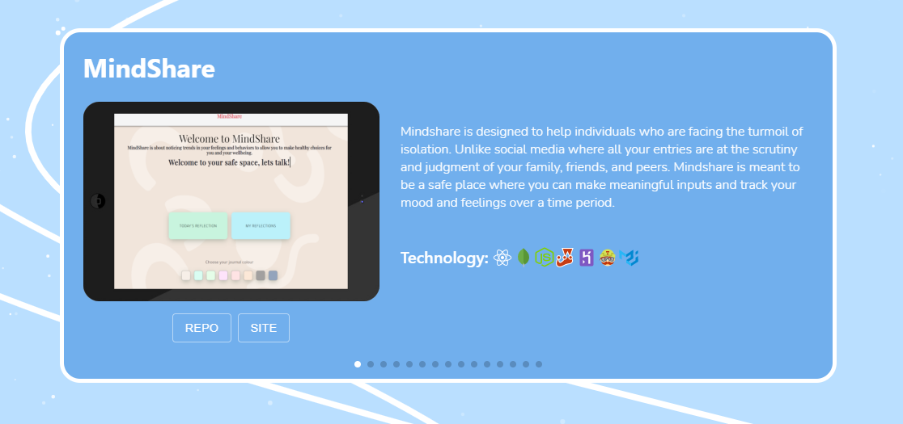

# React-Portfolio

## Description
This website was created to showcase what I have learned so far. This page will serve as a portfolio for future projects that are at production stage.

## Table Of Contents
- [Technologies](#Technologies-Used)
- [Installation](#Installation)
- [Usage](#Usage)
- [Screenshots](#Screenshot)
- [View Live Website](#View-Live-Website)
- [Questions](#Questions)
- [License](#License)

## Technologies Used
For this application I used the following technologies: React, JavaScript, HTML/CSS, Material Ui, Swiper, Gsap, Particles.js, EmailJS and GitHub Pages.

## Screenshot

## View Live Website  

Please click **[Here](https://hustinkava.github.io/portfolio/)** to view the live webpage hosted on GitHub pages

## Questions
To view my other repositories or to connect with me on GitHub please click **[Here](https://github.com/HustinKava/)**
If you have any questions please feel free to reach out to me at the following email: *HustinKava@gmail.com*

## License
